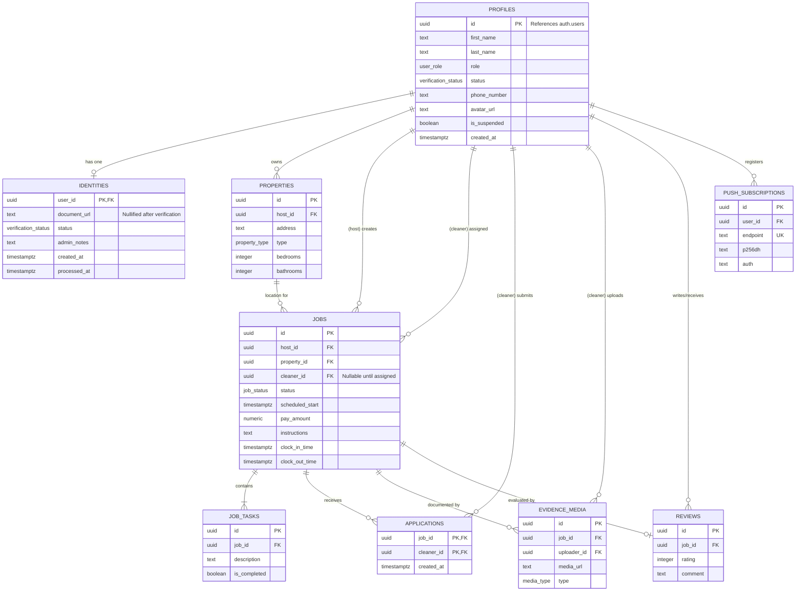

# Database Design

This document outlines the initial design of the database for the [Cleaner Hire PWA](/README.md).

## 1. Custom Enumerated Types

The following `ENUM` types provide structured, type-safe representations of finite sets of data:

- **user_role**: `host`, `cleaner`, `admin`
- **verification_status**: `unverified`, `pending`, `verified`, `rejected`
- **job_status**: `draft`, `pending`, `assigned`, `in_progress`, `completed`, `cancelled`
- **property_type**: `house`, `flat`
- **media_type**: `image`, `video`

## 2. Entity Relationship Diagram (ERD)

